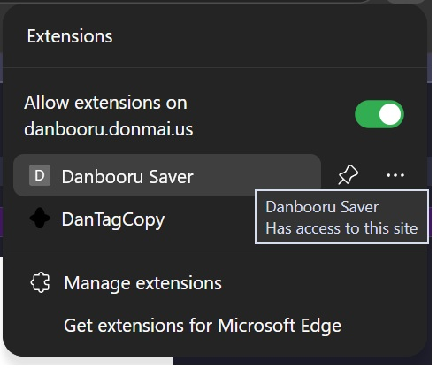

# booru_dataset_extension

A small Chromium-based browser extension for building image datasets from booru-style sites.

At the moment, the extension supports **Danbooru post pages** and lets you save:

- the original image file
- a matching `.txt` sidecar file containing the tags

## What it does

When you open a supported post page and trigger the extension, it:

1. parses the page
2. extracts the image URL
3. extracts the tags
4. downloads the image
5. downloads a matching text file with the tags

This is meant as a convenience tool for **dataset creation**.

## Current status

This project is currently an **unpacked extension** workflow.

In other words, you clone or download the repository and load it manually in a Chromium-based browser such as:

- Microsoft Edge
- Google Chrome
- other Chromium-based browsers

## Supported sites

Currently supported:

- **Danbooru** post pages (`https://danbooru.donmai.us/posts/...`)

Support for other booru-style sites may be added later.

## Installation

### 1. Download the repository

Clone it:

```bash
git clone https://github.com/alexgit256/booru_dataset_extension.git
```

Or download it as a ZIP from GitHub and extract it.

### 2. Open the extensions page in your browser

For Edge:

```text
edge://extensions
```

For Chrome:

```text
chrome://extensions
```

### 3. Enable Developer mode

Turn on **Developer mode** on the extensions page.

### 4. Load the extension

Click **Load unpacked** and select the repository folder.

## Required browser permission

This extension downloads more than one file per click, typically the image and the matching `.txt` file.

Because of that, your browser may block the second download unless you allow **automatic downloads** for the site or session.

You may need to explicitly allow automatic downloads when the browser prompts you.

If downloads do not complete, check your browser’s automatic download settings and allow them for the workflow you are using.

## Warning

Giving this extension download permissions is **not safe**.

Use this tool at your own risk.

This is an unpacked extension intended for local use. It is not audited, not hardened, and not guaranteed to be secure.

## Usage

1. Open a supported post page on Danbooru.
2. Open the extension popup.  
   
3. Trigger the save/capture action.  
   
4. The extension should download:
   - the image
   - the matching tag file
